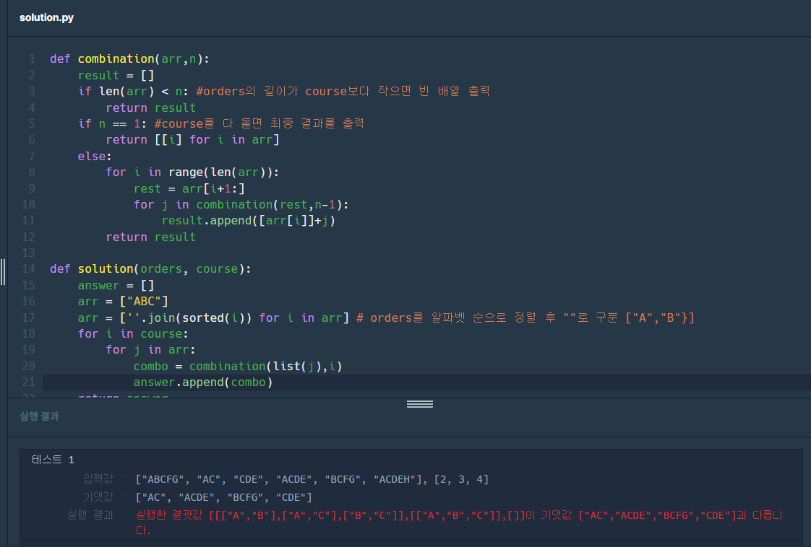
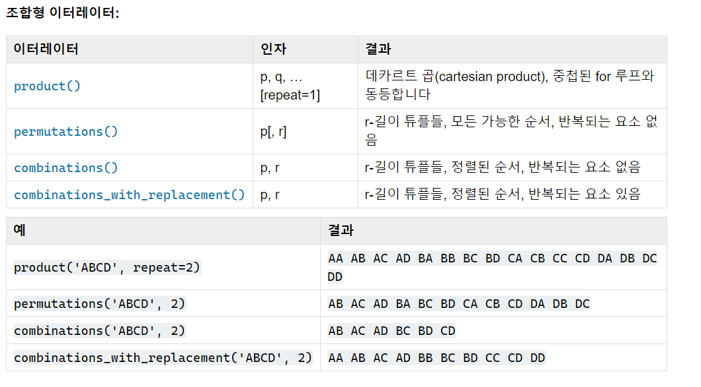

## 1. 그리디

### 수리공 항승 (1449) 
<aside>
💡 문제 정리

1. 파이프에서 물이 새는 곳 - 가장 왼쪽에서 정수만큼 떨어진 거리의 장소
2. 길이가 L인 테이프로 물이 새는 곳을 막음 
    - 적어도 좌우 0.5만큼 간격을 두고 테이프를 붙여야함
3.  물이 새는 곳 위치와 테이프 길이 L이 주어졌을 때, 필요한 테이프의 최소 개수 테이프를 자르거나 겹쳐서 붙이는 것 불가

입력

- 첫째 줄에 물이 새는 곳의 개수 N과 테이프 길이 L 둘째 줄에는 물이 새는 곳의 위치
- 0 < N, L, 물이 새는 위치 <= 1000
</aside>

문제 접근
1. 물이 새는 위치 오름차순 정렬(sort)
2. 시작점, 테이프 숫자를 변수로 선언
3. 반복문을 물이 새는 위치 안에서 돌리면서 위치 사이의 간격이 L보다 큰가 아닌가를 판단


### 강의실 배정 (11000)
<aside>
💡 문제 정리

1. Si에 시작해서 Ti에 끝나는 N개의 수업
2. 이때 최소의 강의실 구하기
3. 수업이 끝나야 다음 수업 가능

입력

- 첫 번째 줄: N(1 ≤ N ≤ 200,000)
- N개의 줄에 Si, Ti(0 ≤ Si < Ti ≤ 109)
</aside>

문제 접근
1. si를 기준으로 값을 정렬
2. 다음 강의의 시작 시간과 종료 시간을 이전 강의와 비교하며 값 추가
3. 우선 순위 큐 사용해야 할듯(실패 코드 이후에 추가한 내용..)

### 실패 코드
1. 틀림
```python
N=int(input()) 
arr = [list(map(int, input().split())) for _ in range(N)]
arr.sort(key = lambda x:x[0])
count = 1
for i in range(N):
    if arr[i][0] <= arr[i+1][0] and arr[i+1][0] < arr[i][1]:
        count+=1
    else:
        continue
print(count)
```

2. 시간 초과(이중 for문 때문인듯) 
```python
N=int(input()) 
arr = [list(map(int, input().split())) for _ in range(N)]
arr.sort(key = lambda x:x[0])
count = 0
end_times = []
for i in range(N):
    for j in range(count):
        if end_times[j] <= arr[i][0]:
            end_times[j] = arr[i][1]
            break
    else:
        end_times.append(arr[i][1])
        count+=1
print(count)
```

3. 역시나 시간 초과(그래도 이중 for 문 사용 시보다는 줄어들었다.)
```python
import heapq

N=int(input()) 
arr = [list(map(int, input().split())) for _ in range(N)]
arr.sort(key = lambda x:x[0])

count = [arr[0][1]]
for i in range(N):
    if count and count[0] <= arr[i][0]:
        heapq.heappop(count)
    heapq.heappush(count, arr[i][1])

print(len(count))
# 처음엔 sort 부분이 문제일까 했지만 input말고 sys.stdin.readline 사용하니 해결되었다..너무 프로그래머스만 풀었나봄
```

## 2. 실전

### 메뉴 리뉴얼 (72411)
<aside>
💡 문제 정리

1. 단품 메뉴를 코스로 재구성해서 새로운 메뉴 제공
2. 이전에 가장 많이 함께 주문한 단품메뉴들을 코스요리 메뉴로 구성
3. 코스요리 메뉴= 최소한 2가지 단품메뉴로 구성, 2명 이상의 손님으로부터 주문된 단품 메뉴의 조합
4. 각 손님들이 주문한 단품메뉴 배열 `orders`, 스카피가 추가하고 싶어하는 메뉴들의 배열 `course`

문제 예시

| 손님 번호 | 주문한 단품메뉴 조합 |
| --- | --- |
| 1번 손님 | A, B, C, F, G |
| 2번 손님 | A, C |
| 3번 손님 | C, D, E |
| 4번 손님 | A, C, D, E |
| 5번 손님 | B, C, F, G |
| 6번 손님 | A, C, D, E, H |

코스요리 메뉴 후보

| 코스 종류 | 메뉴 구성 | 설명 |
| --- | --- | --- |
| 요리 2개 코스 | A, C | 1번, 2번, 4번, 6번 손님으로부터 총 4번 주문됐습니다. |
| 요리 3개 코스 | C, D, E | 3번, 4번, 6번 손님으로부터 총 3번 주문됐습니다. |
| 요리 4개 코스 | B, C, F, G | 1번, 5번 손님으로부터 총 2번 주문됐습니다. |
| 요리 4개 코스 | A, C, D, E | 4번, 6번 손님으로부터 총 2번 주문됐습니다. |
</aside>

### **[제한사항]**

- 2 <= orders <= 20
- 2 <= orders 각 원소 <= 10 인 문자열입니다.
    - 알파벳 대문자로만 이루어져 있습니다.
    - 같은 알파벳이 중복해서 들어있지 않습니다.
- 1 <= course <= 10
    - 각 원소는 2 이상 10 이하인 자연수가 `오름차순`으로 정렬되어 있습니다.
    - 같은 값이 중복해서 들어있지 않습니다.
- 정답은 각 코스요리 메뉴의 구성을 문자열 형식으로 배열에 담아 사전 순으로 `오름차순` 정렬
    - 배열의 각 원소에 저장된 문자열 또한 알파벳 `오름차순`으로 정렬되어야 합니다.
    - 가장 많이 함께 주문된 메뉴 구성이 여러 개라면, 모두 배열에 담아 return 하면 됩니다.
    - orders와 course 매개변수는 return 하는 배열의 길이가 1 이상이 되도록 주어집니다.

문제 접근

1. orders를 알파벳 순으로 정렬
2. course안에 값들 순서로 반복문 실행
3. course의 값보다 길이가 길거나 같은 orders를 찾아서 배열에 추가한다.
4. 이 배열을 기존의 orders와 비교하며 겹치는 값을 찾아낸다
    - 예외 상황
    - ['ABCD','BCDE'] 일 때 course가 2,3,5이면 위의 상황에서 추려지지 않음
    - 직접 비교를 통해 ['BCD'] 만 남기고 문자열을 저장
5. 조건에 맞게 조합을 생성하는 함수와 횟수를 세는 함수를 생성해야함(아마 import할게 있겠지만 일단 구현해보고 찾아볼 예정)
    - 조합을 생성하는 함수 - ["ABC"] n = 2 -> [A,B],[B,C],[A,C] 이렇게 결과가 나오도록 구성해보겠음 
    - 횟수를 세는 함수를 생성

### 문제 풀이

1. 조합 생성 함수
```python
def combination(arr,n):
    result = []
    if len(arr) < n: #orders의 길이가 course보다 작으면 빈 배열 출력
        return result
    if n == 1: #course를 다 돌면 최종 결과를 출력
        return [[i] for i in arr]
    else:
        for i in range(len(arr)):
            rest = arr[i+1:]
            for j in combination(rest,n-1):
                result.append([arr[i]]+j)
        return result
```


- 이걸 사용하면 조합 생성 함수를 생성할 필요가 없었다


2. 횟수 카운트 함수
```python
def count(combos):
    count = {}
    for i in combos:
        if i in count:
            count[i] += 1
        else:
            count[i] = 1
    return count
```